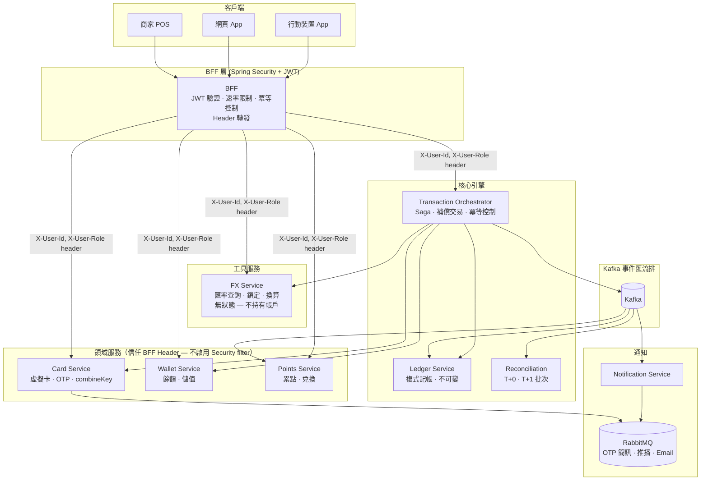

# 系統架構

本章說明 WillCard 的系統架構，內容涵蓋指導服務設計的架構原則、完整的微服務清單與各服務的層級定位及職責，以及高層次拓撲圖, 說明請求如何從客戶端經由 BFF 層流入領域服務、核心交易引擎與基礎設施，包含網路邊界、Kafka 事件匯流排與通知管道。

## 架構原則

### 1. 兩種微服務類型

- **BFF（Backend-for-Frontend）**：唯一對外入口, 負責 JWT 驗證、冪等控制、請求聚合與 Header 轉發。
- **領域服務（Domain Services）**：每個服務擁有自己的限界上下文；服務間不得直接跨域呼叫。

### 2. 分散式交易

- **Saga 編排**：跨服務交易由 Transaction Orchestrator 統一協調；補償交易確保資料一致性。
- **事件驅動**：服務透過 Kafka 事件匯流排解耦；每個消費者群組獨立運作。
- **不可變帳本**：日誌分錄僅允許 INSERT——任何情況下均不執行 UPDATE 或 DELETE。

## 微服務清單

| # | 服務 | 層次 | 職責 |
|---|---|---|---|
| 1 | BFF | 展示層 | 請求聚合、JWT 驗證、Rate limit、冪等控制、header forwarding |
| 2 | Card Service | Domain | 虛擬卡管理、OTP 生成驗證、卡片狀態機、combineKey |
| 3 | Wallet Service | Domain | 台幣點數餘額、儲值指令 |
| 4 | Points Service | Domain | 點數帳戶、回饋計算、兌換、到期管理 |
| 5 | FX Service | Utility | 匯率查詢、鎖定匯率（無狀態計算工具，不持有帳戶） |
| 6 | Transaction Orchestrator | Core | Saga 協調、補償交易、冪等控制 |
| 7 | Ledger Service | Core | Double-entry 帳本、journal entries、不可變 |
| 8 | Reconciliation Service | Core | T+0 即時對帳、T+1 批次清算、差異報表 |
| 9 | Notification Service | Infra | OTP SMS、交易推播、Email receipt |

> **FX Service 定位說明：**
> FX Service 是無狀態的匯率計算工具，不持有任何帳戶，不參與 Saga 狀態管理。職責僅限於匯率資料的查詢、鎖定與換算計算，歸類為 Utility Service 而非 Domain Service.

