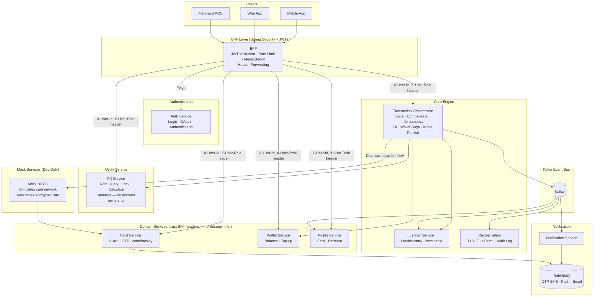

# System Architecture

This chapter describes the system architecture of WillCard, including the architectural principles that govern service design, a complete microservice inventory with each service's layer and responsibility, and a high-level topology diagram illustrating how requests flow from clients through the BFF layer into domain services.

## Architecture Principles

### 1. two types of microservice

- **BFF (Backend-for-Frontend)**: Single external entry point — JWT validation, idempotency control, request aggregation, header forwarding.
- **Domain Services**: Each service owns its bounded context; no direct cross-domain service calls.

### 2. Distributed Transactions

- **Saga Orchestration**: Cross-service transactions coordinated by the Transaction Orchestrator; compensating transactions ensure consistency.
- **Event-Driven**: Services decouple via Kafka event bus; each consumer group operates independently.
- **Immutable Ledger**: Journal entries are INSERT-only — no UPDATE or DELETE ever

## Microservice Inventory

| # | Service | Layer | Responsibility |
| --- | --- | --- | --- |
| 1 | BFF | Presentation | Request aggregation, JWT validation, rate limiting, idempotency, header forwarding |
| 2 | Card Service | Domain | Virtual card management, OTP generation/validation, card state machine, combineKey |
| 3 | Wallet Service | Domain | TWD points balance, top-up commands |
| 4 | Points Service | Domain | Points account, reward calculation, redemption, expiry management |
| 5 | FX Service | Utility | Exchange rate query and locking (stateless calculator — no account ownership) |
| 6 | Transaction Orchestrator | Core | Saga coordination, compensating transactions, idempotency control; orchestrates FX conversion, wallet reserve/confirm/release, and Kafka publish for card payment flow |
| 7 | Ledger Service | Core | Double-entry ledger, journal entries, immutable |
| 8 | Reconciliation Service | Core | T+0 real-time reconciliation, T+1 batch settlement, discrepancy reports; Operation Log audit consumer (Kafka → DB) |
| 9 | Notification Service | Infra | OTP SMS, transaction push notifications, email receipts |
| 10 | Auth Service | Domain | Login, OAuth, user authentication and authorization |
| 11 | Mock NCCC | Mock (Dev only) | Simulates NCCC card network behavior in the development environment; called by Transaction Orchestrator; retrieves plain card data from card-service internal endpoint, assembles `encryptedCard`, and forwards to `card-service auth/authorize`; replaced by real NCCC integration in production |

> **FX Service positioning:**
> FX Service is a stateless exchange rate utility. It holds no accounts and participates in no Saga state management. Its sole responsibility is rate query, locking, and conversion calculation.

> **Mock NCCC positioning:**
> In production, the card network (NCCC) routes inbound authorization requests to WillCard as the issuer. In this project's development environment, the direction is reversed: Transaction Orchestrator actively calls Mock NCCC, which simulates the card network's role of assembling and forwarding encrypted card data to card-service. Mock NCCC is a dev-only service and is not deployed in production.

Next Chapter: [Infrastructure Configuration](/guideline/2-infrastructure.md)
