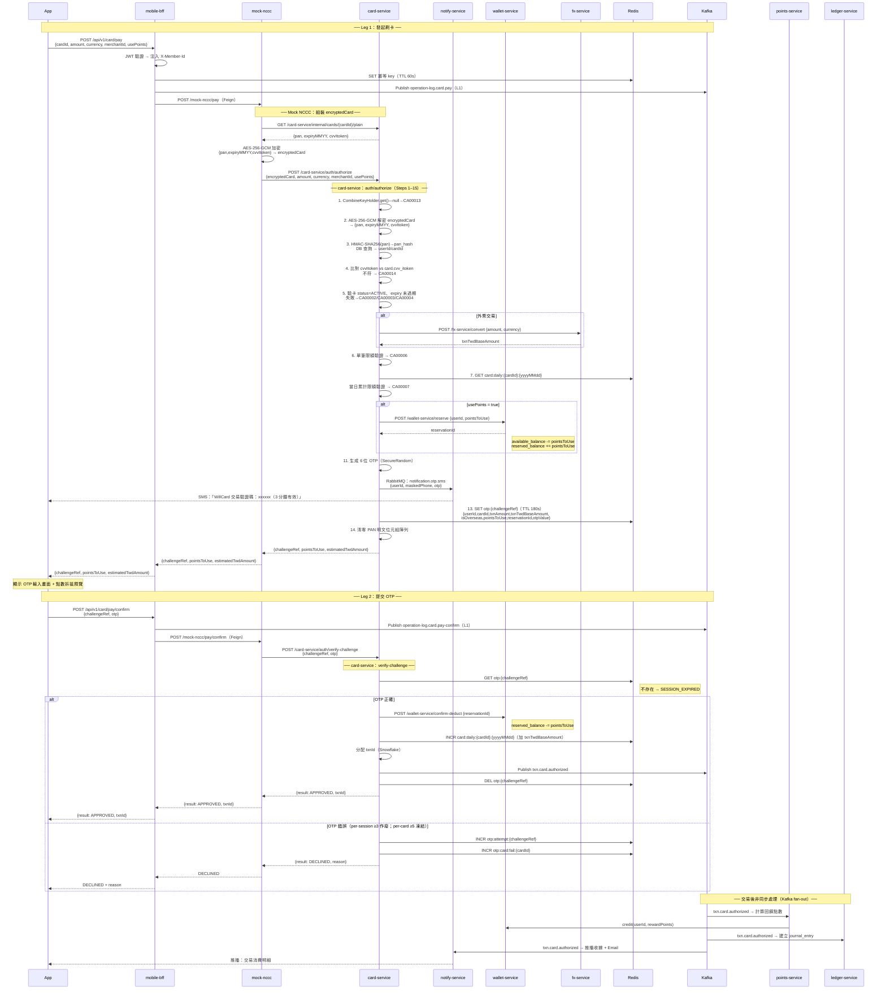

# 交易流程規範

本章定義 WillCard 信用卡交易的業務規則、流程設計與撰寫慣例。所有涉及刷卡交易的 spec 文件（`spec/mobile-bff/card-pay*`、`spec/mock-nccc/`、`spec/card-service/`、`spec/wallet-service/`、`spec/points-service/`、`spec/ledger-service/`）均須遵循本章規定。

---

## 1. WillCard 作為發卡機構（Issuer）

WillCard 發行以會員電子錢包餘額為基礎的虛擬 Visa/Mastercard 信用卡。在台灣支付生態系中，**NCCC（聯合信用卡處理中心 / 財金公司）** 扮演卡組織與清算中心的角色。

**WillCard 是 Issuer。持卡人從 App 發起交易；WillCard BFF 主動呼叫 Mock NCCC，將交易資訊與 CVV iToken 一併轉發；Mock NCCC 再呼叫 card-service 執行 Issuer 授權。**

> 在真實正式環境中，卡組織（NCCC）會將授權請求向內路由至 WillCard（作為 Issuer）。本專案採用 Mock NCCC，流向相反：由 App 透過 BFF 觸發，WillCard 主動對外呼叫 Mock NCCC。

```
[正式環境參考 — 由卡組織流入]
持卡人在特店使用虛擬卡
  → 特店收銀機 / 結帳頁
  → 收單銀行
  → NCCC
  → WillCard Card Service（Issuer Authorization API）← 在此被呼叫
       ↓ 授權成功（非同步，Kafka fan-out）
  Points Service · Ledger Service · Notification Service

[開發環境 — WillCard 主動呼叫 Mock NCCC]
App → BFF → Mock NCCC Service
              ↓（轉發交易資訊 + cvvItoken）
              → WillCard Card Service（auth/authorize）
                   ↓ 授權成功（非同步，Kafka fan-out）
             Points Service · Ledger Service · Notification Service
```

**關鍵識別符：**

| 欄位 | 產生方 | 生命週期 | 用途 |
|------|--------|---------|------|
| `challengeRef` | Card Service（auth/authorize） | OTP session（TTL 180s） | OTP 綁定；串接 authorize 與 verify-challenge |
| `txnId` | Card Service（verify-challenge，授權成功時） | 交易記錄 | 帳本、Kafka event、對帳 |
| `reservationId` | Wallet Service（reserve） | 點數凍結（TTL 180s） | 連接點數預留與交易；不折抵時為 null |

---

## 2. 完整端對端交易流程

### 2.1 時序圖



### 2.2 逐步服務說明

| # | 服務 | 動作 | Redis / DB / Event 狀態 |
|---|------|------|--------------------------|
| **Leg 1 — 發起刷卡** | | | |
| 1 | App | `POST /api/v1/card/pay` — `{cardId, amount, currency, merchantId, usePoints}` | — |
| 2 | BFF | JWT 驗證；提取 `userId`；注入 `X-Member-Id` header | — |
| 3 | BFF | 檢查 Redis 冪等 key；重複請求 → 回傳快取結果 | Redis `SET idempotency:{hash}` TTL 60s |
| 4 | BFF | Publish `operation-log.card.pay`（L1） | Kafka：`operation-log.card.pay` |
| 5 | BFF→Mock NCCC | Feign `POST /mock-nccc/pay` | — |
| 6 | Mock NCCC | Feign `GET /card-service/internal/cards/{cardId}/plain` | — |
| 7 | Card Service | 從 DB 回傳 `{pan, expiryMMYY, cvvItoken}`（僅 dev/mock profile） | DB READ `card` |
| 8 | Mock NCCC | AES-256-GCM 加密 `{pan, expiryMMYY, cvvItoken}` → `encryptedCard`（使用 `MOCK_COMBINE_KEY`） | — |
| 9 | Mock NCCC→Card Service | Feign `POST /card-service/auth/authorize` | — |
| **auth/authorize — 解密與驗證** | | | |
| 10 | Card Service | `CombineKeyHolder.get()` 取得 combineKey；null → 拋 `CA00013` HTTP 503 | — |
| 11 | Card Service | AES-256-GCM 解密 `encryptedCard` → JVM Heap 中的 `{pan, expiryMMYY, cvvItoken}` | — |
| 12 | Card Service | `HMAC-SHA256(pan, PAN_HMAC_KEY)` → `pan_hash`；DB 以 `pan_hash` 查詢 `cardId`、`userId` | DB READ `card` |
| 13 | Card Service | 比對收到的 `cvvItoken` 與 `card.cvv_itoken`；不符 → 拋 `CA00014` | DB READ |
| 14 | Card Service | 驗卡：`status = ACTIVE`、expiry 未過期；失敗 → `CA00002` / `CA00003` / `CA00004` | DB READ |
| **auth/authorize — 限額與點數** | | | |
| 15 | Card Service | 判斷幣別：TWD → `txnTwdBaseAmount = amount`；外幣 → Feign `POST /fx-service/convert` | Feign：fx-service |
| 16 | Card Service | 單筆限額：`txnTwdBaseAmount ≤ single_txn_limit`（INFINITE 跳過）→ `CA00006` | DB READ `card_type_limit` |
| 17 | Card Service | 當日累計：Redis `GET card:daily:{cardId}:{yyyyMMdd}` + `txnTwdBaseAmount ≤ daily_limit` → `CA00007` | Redis READ |
| 18 | Card Service | 點數計算：`usePoints ? min(available_balance, txnTwdBaseAmount) : 0` → `pointsToUse` | Feign：wallet-service |
| 19 | Card Service | 若 `pointsToUse > 0`：Feign `wallet-service/reserve(userId, pointsToUse)` → `reservationId` | `available_balance -= pts`，`reserved_balance += pts` |
| **auth/authorize — OTP 與回傳** | | | |
| 20 | Card Service | 生成 6 位 OTP（`SecureRandom`） | 僅存於 JVM Heap |
| 21 | Card Service | Publish RabbitMQ `notification.otp.sms` `{userId, maskedPhone, otp}` | RabbitMQ queue |
| 22 | Notify Service | Consume `notification.otp.sms`；發送 SMS 至會員手機 | SMS 已送出 |
| 23 | Card Service | `SET` Redis OTP session `otp:{challengeRef}`（TTL 180s，含完整交易上下文 + `otpValue`） | Redis WRITE |
| 24 | Card Service | 清零 PAN 明文位元組陣列（try-finally 保證執行） | — |
| 25 | Card Service | 回傳 `{challengeRef, pointsToUse, estimatedTwdAmount}` | — |
| 26 | Mock NCCC | 轉發回應給 BFF | — |
| 27 | BFF | 回傳 `{challengeRef, pointsToUse, estimatedTwdAmount}` 給 App | — |
| 28 | App | 顯示 OTP 輸入畫面 + 點數折抵預覽 | — |
| **Leg 2 — 提交 OTP** | | | |
| 29 | App | `POST /api/v1/card/pay/confirm` — `{challengeRef, otp}` | — |
| 30 | BFF | JWT 驗證；Publish `operation-log.card.pay-confirm`（L1） | Kafka：`operation-log.card.pay-confirm` |
| 31 | BFF→Mock NCCC | Feign `POST /mock-nccc/pay/confirm` | — |
| 32 | Mock NCCC→Card Service | Feign `POST /card-service/auth/verify-challenge` | — |
| **verify-challenge — OTP 正確路徑** | | | |
| 33 | Card Service | Redis `GET otp:{challengeRef}`；不存在 → `DECLINED + SESSION_EXPIRED` | Redis READ |
| 34 | Card Service | 比對 `session.otpValue == 輸入 otp`；一致 → 繼續 | — |
| 35 | Card Service | 若 `reservationId` 不為 null：Feign `wallet-service/confirm-deduct(reservationId)` | `reserved_balance -= pts` |
| 36 | Card Service | Redis `INCR card:daily:{cardId}:{yyyyMMdd}` 加 `txnTwdBaseAmount`；設 TTL 至 23:59:59 | Redis WRITE |
| 37 | Card Service | 分配 `txnId`（Snowflake） | — |
| 38 | Card Service | Kafka Publish `txn.card.authorized`（完整 payload） | Kafka：`txn.card.authorized` |
| 39 | Card Service | Redis `DEL otp:{challengeRef}` | Redis DELETE |
| 40 | Card Service | 回傳 `{result: APPROVED, txnId}` | — |
| 41 | Mock NCCC / BFF | 轉發 `APPROVED + txnId` 給 App | — |
| **verify-challenge — OTP 錯誤路徑** | | | |
| 42 | Card Service | `INCR otp:attempt:{challengeRef}`（TTL 180s）；≥ 3 → 作廢 session + 若有 `reservationId` 則 release → `DECLINED + SESSION_VOIDED` | Redis WRITE |
| 43 | Card Service | `INCR otp:card:fail:{cardId}`（TTL 900s）；≥ 5 → 卡片 FROZEN + Kafka `card.risk.otp-threshold-exceeded` + release → `DECLINED + CARD_LOCKED` | Redis WRITE；Kafka |
| 44 | Card Service | 回傳 `DECLINED + OTP_FAILED + attemptsRemaining` | — |
| **交易後非同步處理（Kafka fan-out）** | | | |
| 45 | Points Service | Consume `txn.card.authorized`；計算 `reward_points`；Feign `wallet-service/credit`；INSERT `point_reward_batch`（PENDING） | DB WRITE `point_reward_batch` |
| 46 | Ledger Service | Consume `txn.card.authorized`；INSERT `journal_entry` 分錄（冪等：`ON DUPLICATE IGNORE`） | DB WRITE `journal_entry` |
| 47 | Notify Service | Consume `txn.card.authorized`；推播通知 + Email 交易收據 | 推播 + Email 已送出 |

---

## 3. Issuer Authorization API（Card Service）

Card Service 對外暴露兩個端點，供 **NCCC 直接呼叫**（正式環境使用 mutual TLS；開發環境由 Mock NCCC 走內網）。

| 端點 | 呼叫方 | 用途 |
|------|--------|------|
| `POST /card-service/auth/authorize` | NCCC / Mock NCCC | 解密卡片資料、驗卡、生成 OTP |
| `POST /card-service/auth/verify-challenge` | NCCC / Mock NCCC | OTP 驗證；最終核准或拒絕 |

### 3.1 auth/authorize — UseCase Flow

```
Request: { encryptedCard, amount, currency, merchantId, usePoints, userId }

Step  1  [DOMAIN]     CombineKeyHolder.get()——null → CA00013 HTTP 503
Step  2  [DOMAIN]     AES-256-GCM 解密 encryptedCard → { pan, expiryMMYY, cvvItoken }
Step  3  [DB READ]    HMAC-SHA256(pan, PAN_HMAC_KEY) → pan_hash；SELECT card WHERE pan_hash = ?
Step  4  [DOMAIN]     比對 cvvItoken：encryptedCard.cvvItoken == card.cvv_itoken；不符 → CA00014
Step  5  [DOMAIN]     驗卡：status = ACTIVE、expiry ≥ today；失敗 → CA00002 / CA00003 / CA00004
Step  6  [DOMAIN]     幣別判斷：TWD → txnTwdBaseAmount = amount；外幣 → Feign POST /fx-service/convert
Step  7  [DOMAIN]     單筆限額：txnTwdBaseAmount ≤ single_txn_limit（INFINITE 跳過）→ CA00006
Step  8  [REDIS READ] 當日累計：GET card:daily:{cardId}:{yyyyMMdd} + txnTwdBaseAmount ≤ daily_limit → CA00007
Step  9  [FEIGN]      讀取 wallet available_balance；pointsToUse = usePoints ? min(balance, txnTwdBaseAmount) : 0
Step 10  [FEIGN]      若 pointsToUse > 0：wallet-service.reserve(userId, pointsToUse) → reservationId
Step 11  [DOMAIN]     生成 6 位 OTP（SecureRandom）
Step 12  [RABBIT]     Publish notification.otp.sms { userId, maskedPhone, otp }
Step 13  [REDIS WRITE] SET otp:{challengeRef} TTL 180s（見 §3.3 payload）
Step 14  [DOMAIN]     清零 PAN 明文位元組陣列（try-finally 保證執行）
Step 15  [RETURN]     { challengeRef, pointsToUse, estimatedTwdAmount }

補償：Step 6 以後任何失敗且已 reserve → release(reservationId)
```

### 3.2 auth/verify-challenge — UseCase Flow

```
Request: { challengeRef, otp }

Step  1  [REDIS READ]  GET otp:{challengeRef}；不存在 → DECLINED + SESSION_EXPIRED

── OTP 正確 ──
Step  2  [FEIGN]       若 reservationId != null：wallet-service.confirmDeduct(reservationId)
Step  3  [REDIS WRITE] INCR card:daily:{cardId}:{yyyyMMdd} 加 txnTwdBaseAmount；EXPIREAT 23:59:59
Step  4  [DOMAIN]      分配 txnId（Snowflake）
Step  5  [KAFKA]       Publish txn.card.authorized（見 §6.1 payload）
Step  6  [REDIS]       DEL otp:{challengeRef}
Step  7  [RETURN]      { result: APPROVED, txnId }

── OTP 錯誤 ──
Step  8  [REDIS WRITE] INCR otp:attempt:{challengeRef}（TTL 180s）
         ≥ 3 → 作廢 session；若有 reservationId → release；RETURN DECLINED + SESSION_VOIDED
Step  9  [REDIS WRITE] INCR otp:card:fail:{cardId}（TTL 900s）
         ≥ 5 → UPDATE card SET status=FROZEN；Kafka card.risk.otp-threshold-exceeded；release；RETURN DECLINED + CARD_LOCKED
Step 10  [RETURN]      DECLINED + OTP_FAILED + attemptsRemaining
```

### 3.3 Redis OTP Session Payload

```json
{
  "userId": 123,
  "cardId": 456,
  "txnAmount": 10000,
  "txnCurrency": "USD",
  "txnTwdBaseAmount": 316000,
  "isOverseas": true,
  "pointsToUse": 5000,
  "reservationId": 789,
  "merchantId": "MERCHANT_001",
  "otpValue": "123456"
}
```

> `txnTwdBaseAmount`：台幣交易時等於 `amount`；外幣交易為 FX 換算後台幣金額。
> `reservationId`：`pointsToUse = 0` 時為 null。

---

## 4. OTP 失敗閾值

兩層獨立機制並存，分別應對「誤輸入重試」與「盜卡試探」。

**第一層 — Per-challengeRef（session 層級）**

| 項目 | 值 |
|------|---|
| Redis Key | `otp:attempt:{challengeRef}`（TTL 180s）|
| 最大重試次數 | 3 次 |
| 達到上限 | 本次授權作廢；卡片不受影響；若有 reservationId 則 release |

**第二層 — Per-card 滑動視窗（詐欺偵測）**

| 項目 | 值 |
|------|---|
| Redis Key | `otp:card:fail:{cardId}`（TTL 900s / 15 分鐘）|
| 觸發閾值 | **15 分鐘內跨 challengeRef 累計失敗 5 次** |
| 達到閾值 | 卡片凍結（`status = FROZEN`）+ Kafka `card.risk.otp-threshold-exceeded` + release reservationId |

每次失敗**同時**累加兩層計數器。

---

## 5. Mock NCCC（開發與測試）

Mock NCCC 是**僅用於開發環境**的服務，橋接 BFF 與 card-service，模擬 NCCC 行為。

**card-plain 內部端點**（`GET /card-service/internal/cards/{cardId}/plain`）：
- 僅 dev/mock profile 啟用；Nginx 封鎖外部流量（`/internal/` 路徑）
- 從 DB 以明文回傳 `{ pan, expiryMMYY, cvvItoken }`
- Spec：[spec/card-service/card-plain.md](../spec/card-service/card-plain.md)

**encryptedCard 組裝方式：**
```
encryptedCard = AES-256-GCM(
  plaintext: JSON{ pan, expiryMMYY, cvvItoken },
  key: MOCK_COMBINE_KEY,
  iv: 隨機生成，前綴拼接至密文
)
```

**MOCK_COMBINE_KEY** 為 `application-dev.yml` 中的固定 256-bit 金鑰。正式環境的 combineKey 由 `card_key_parts` 資料表中的三把加密 source key XOR 合成，常駐 JVM Heap。詳見 [guideline/14-3ds-combine-key-zh-tw.md](14-3ds-combine-key-zh-tw.md)。

---

## 6. 交易後非同步處理

`txn.card.authorized` 發布至 Kafka 後，三個獨立 Consumer 以 fan-out 模式並行處理。

### 6.1 Kafka Payload — `txn.card.authorized`

```json
{
  "txnId": "Snowflake ID",
  "userId": 123,
  "cardId": 456,
  "cardType": "OVERSEAS",
  "maskedPan": "****-****-****-1234",
  "merchantId": "MERCHANT_001",
  "txnAmount": 10000,
  "txnCurrency": "USD",
  "txnTwdBaseAmount": 316000,
  "isOverseas": true,
  "pointsToUse": 5000,
  "txnTimestamp": "2026-03-30T10:00:00.000Z"
}
```

### 6.2 Points Service

- Kafka Consumer：`txn.card.authorized`（冪等：`uk_pil_source_txn_id`）
- 計算 `reward_points = floor(txnTwdBaseAmount × reward_rate)`（見 §9）
- Feign `wallet-service/credit(userId, rewardPoints)`
- INSERT `point_reward_batch`（status = PENDING；到期日為 txnTimestamp 所在月份一年後月底）

### 6.3 Ledger Service

- Kafka Consumer：`txn.card.authorized`（冪等：`ON DUPLICATE KEY IGNORE` on `idempotency_key`）
- 依情境 INSERT `journal_entry` 分錄（見 §12.4）

### 6.4 Notification Service — 交易收據

- Kafka Consumer：`txn.card.authorized`
- 內部轉發至 RabbitMQ queue `notification.txn.receipt`
- 推播通知 + Email 交易消費明細

---

## 7. 點數折抵規則（偏好驅動）

### 7.1 偏好設定

**Table: `member_points_preference`（Wallet Service DB）**

| 欄位 | 型別 | 說明 |
|------|------|------|
| `user_id` | BIGINT PK | |
| `points_first_enabled` | BOOLEAN | 交易時自動套用點數折抵 |
| `max_points_per_txn` | INT | 單筆折抵上限（NULL = 無上限）|
| `updated_at` | DATETIME | |

### 7.2 授權時的自動計算

```
if points_first_enabled:
  pointsToUse = min(
    available_points_balance,
    txnTwdBaseAmount,
    max_points_per_txn ?? ∞
  )
else:
  pointsToUse = 0

estimatedTwdAmount = txnTwdBaseAmount - pointsToUse
```

### 7.3 換算規則

| 規則 | 值 |
|------|---|
| 換算比例 | **1 點 = NT$1**（1:1）|
| 最小折抵 | 1 點 |
| 最大折抵 | 全額（100% offset）|
| 交易記錄 | `pointsToUse` 與 `estimatedTwdAmount` 均須記錄 |

### 7.4 Reserve-Confirm-Release

```
auth/authorize：
  wallet-service.reserve(userId, pointsToUse)
  → available_balance -= pointsToUse
  → reserved_balance  += pointsToUse
  Reserve TTL = 180s（與 OTP TTL 對齊；惰性清理）

verify-challenge — APPROVED：
  wallet-service.confirmDeduct(reservationId)
  → reserved_balance -= pointsToUse

補償（OTP 失敗 / DECLINED / TTL 到期）：
  wallet-service.release(reservationId)
  → reserved_balance -= pointsToUse
  → available_balance += pointsToUse
```

---

## 8. Saga 補償規則

| Saga 步驟 | 補償動作 | 觸發條件 |
|-----------|---------|---------|
| 點數 reserve | `release(reservationId)` | 驗卡失敗、限額超過、OTP 失敗（≥3）、卡片鎖定、Session 過期（惰性） |
| 匯率鎖定 | FX Rate TTL 自動到期 | 無需主動補償 |
| 帳本分錄 | 寫入 REVERSAL 反向分錄（禁止刪除） | 退款流程（另立 spec）|

帳本分錄為**不可變**。帳本層補償一律以新的反向分錄處理，禁止 UPDATE 或 DELETE。

---

## 9. 點數回饋計算規則

### 9.1 回饋基數與計算方式

- 回饋計算基數：`txnTwdBaseAmount`（不含點數折抵部分）
- 計算結果**無條件捨去（floor）**，不四捨五入
- 外幣交易以 `twd_base`（純換算金額，不含 1.5% 手續費）為基數

```
回饋點數 = floor(txnTwdBaseAmount × reward_rate)

範例：txnTwdBaseAmount = 60, reward_rate = 2%
  60 × 0.02 = 1.2 → floor → 1 點
```

### 9.2 回饋方案（MCC 對應）

回饋率儲存於 Points Service DB 的 `reward_plan` 表。啟動時（`ApplicationReadyEvent`）載入 `Map<String, BigDecimal>`（以 `mcc_code` 為 key）；寫入時 cache invalidation；讀取不觸及 DB。若找不到 MCC 對應，回退至 `mcc_code = 'DEFAULT'`。

**Table: `reward_plan`**

| 欄位 | 型別 | 說明 |
|------|------|------|
| `plan_id` | BIGINT PK | Snowflake |
| `mcc_code` | VARCHAR(10) | MCC 代碼；`DEFAULT` 為全類別預設 |
| `reward_rate` | DECIMAL(5,4) | 例：`0.0200` = 2% |
| `effective_from` | DATE | 生效日期 |
| `effective_to` | DATE | 到期日期（null = 永久有效）|
| `created_at` | DATETIME | |

### 9.3 回饋點數 Batch 設計

每次回饋發放產生一筆 `point_reward_batch` 記錄，獨立追蹤剩餘餘額與到期時間，支援 FIFO 扣抵與精準到期管理。

**Table: `point_reward_batch`**

| 欄位 | 型別 | 說明 |
|------|------|------|
| `batch_id` | BIGINT PK | Snowflake |
| `user_id` | BIGINT | |
| `source_txn_id` | BIGINT | 來源交易 |
| `issued_amount` | INT | 發放點數 |
| `remaining_balance` | INT | 剩餘可用（兌換時遞減）|
| `status` | VARCHAR | `PENDING` / `CONFIRMED` / `EXPIRED` / `CANCELLED` |
| `expires_at` | DATETIME | `issued_at + 1 年` |
| `created_at` | DATETIME | |

**狀態流轉：**
```
PENDING   →  CONFIRMED   （T+1 清算成功）
PENDING   →  CANCELLED   （清算前退款）
CONFIRMED →  EXPIRED     （到期日到達）
CONFIRMED →  CANCELLED   （清算後退款）
```

---

## 10. 外幣交易規則

| 規則 | 值 |
|------|---|
| 台幣交易 | 不收手續費 |
| 外幣手續費 | `twd_base` 的 **1.5%**，加收於換算金額之上 |
| 帳本記帳幣別 | 一律以台幣記帳，同時記錄原幣金額與使用匯率 |
| 回饋計算基數 | `twd_base`（純匯率換算，不含手續費）|
| 特店手續費計算基礎 | `twd_base`——`fx_fee` 是 WillCard 向持卡人額外收取，不屬特店服務 |

**外幣金額計算：**

```
twd_base      = foreign_amount × fx_rate
fx_fee        = floor(twd_base × 0.015)
total_twd     = twd_base + fx_fee        ← estimatedTwdAmount（會員實際扣款）
reward_points = floor(twd_base × reward_rate)
```

範例：USD$100，匯率 31.0，回饋率 1%
```
twd_base      = 100 × 31.0 = 3,100
fx_fee        = floor(3,100 × 0.015) = 46
total_twd     = 3,100 + 46 = 3,146
reward_points = floor(3,100 × 0.01) = 31 點
```

---

## 11. 交易限額規則

限額依卡片種類設定，儲存於 Card Service DB 的 `card_type_limit` 表（台幣分，`BIGINT`，`NULL` = 無上限）。

| card_type | 單筆上限 | 單日累計上限 |
|-----------|---------|------------|
| CLASSIC | NT$100,000 | NT$200,000 |
| OVERSEAS | NT$100,000 | NT$200,000 |
| PREMIUM | NT$200,000 | NT$500,000 |
| INFINITE | 無上限 | 無上限 |

兩個限額均在 OTP 生成前完成驗證；任一失敗即拒絕，且不執行任何點數 reserve。

---

## 12. 複式帳本規則

### 12.1 設計原則

- 帳本分錄**不可變**——僅允許 INSERT，禁止 UPDATE / DELETE
- 每筆交易產生一組借貸平衡分錄
- 補償一律寫入新的 REVERSAL 反向分錄

### 12.2 帳戶結構

| 帳戶代碼 | 帳戶名稱 | 說明 |
|----------|---------|------|
| `1001` | 應收會員款（Member Receivable）| 授權時對會員虛擬卡收取的金額 |
| `1002` | 清算備付金（Settlement Reserve）| 銀行清算帳戶現金；T+1 付款特店時借出 |
| `2001` | 應付特店款（Merchant Payable）| 應結算給特店的淨額（含點數補貼，手續費已扣除）|
| `2002` | 點數負債（Points Liability）| 已發放但未使用的回饋點數（1 點 = NT$1）|
| `3001` | 特店手續費收入（Merchant Fee Income）| 每筆台幣交易向特店收取的服務費 |
| `3002` | 外幣手續費收入（FX Fee Income）| 外幣交易收取的 1.5% 手續費 |
| `4001` | 點數回饋費用（Reward Points Expense）| 發放回饋點數給會員的成本 |
| `5001` | 匯差損益（FX Gain/Loss）| WillCard 持有外幣部位時的匯差損益 |

### 12.3 分錄類型

| `journal_type` | 觸發時機 |
|---------------|---------|
| `AUTHORIZATION` | Kafka `txn.card.authorized` |
| `SETTLEMENT` | T+1 批次清算 — DR 2001 / CR 1002 |
| `REVERSAL` | 退款（另立 spec）|
| `REWARD` | 回饋點數發放（非同步，由 Kafka event 觸發）|

### 12.4 分錄範例

**情境一：台幣 NT$100，無折抵，回饋率 1%，特店手續費 3%**

| 借方 | 金額 | 貸方 | 金額 |
|------|------|------|------|
| 應收會員款(1001) | 100 | 應付特店款(2001) | 97 |
| | | 特店手續費收入(3001) | 3 |
| 回饋費用(4001) | 1 | 點數負債(2002) | 1 |

**情境二：台幣 NT$100，折抵 34 點 + 刷卡 NT$66，回饋率 1%，手續費 3%**

| 借方 | 金額 | 貸方 | 金額 |
|------|------|------|------|
| 應收會員款(1001) | 66 | 應付特店款(2001) | 64.02 |
| | | 特店手續費收入(3001) | 1.98 |
| 點數負債(2002) | 34 | 應付特店款(2001) | 34 |
| 回饋費用(4001) | 0 | 點數負債(2002) | 0 |

> 特店共收到 NT$100（64.02 + 1.98 手續費保留 + 34.00 補貼）。

**情境三：外幣 USD$100，匯率 31.0，回饋率 1%，手續費 3%**
```
twd_base = 3,100 | fx_fee = 46 | total_twd = 3,146 | 回饋 = 31 點
```

| 借方 | 金額 | 貸方 | 金額 |
|------|------|------|------|
| 應收會員款(1001) | 3,146 | 應付特店款(2001) | 3,007 |
| | | 特店手續費收入(3001) | 93 |
| | | 外幣手續費收入(3002) | 46 |
| 回饋費用(4001) | 31 | 點數負債(2002) | 31 |

### 12.5 `journal_entry` 欄位定義

| 欄位 | 型別 | 說明 |
|------|------|------|
| `entry_id` | BIGINT PK | Snowflake |
| `idempotency_key` | VARCHAR(100) UNIQUE | `{messageKey}_{entry_seq}`——防止 Kafka Consumer 重試時重複寫入 |
| `txn_id` | BIGINT | 來源交易 ID |
| `journal_type` | VARCHAR(20) | 見 §12.3 |
| `entry_type` | VARCHAR(10) | `DEBIT` / `CREDIT` |
| `account_code` | VARCHAR(10) | 見 §12.2 |
| `amount` | DECIMAL(15,4) | 金額 |
| `currency` | VARCHAR(3) | `TWD` / `USD` / ... |
| `fx_rate` | DECIMAL(10,6) | 台幣交易填 `1.0` |
| `amount_twd` | DECIMAL(15,4) | 台幣換算金額 |
| `memo` | VARCHAR(255) | 說明 |
| `created_at` | DATETIME(3) | 不可變，無 `updated_at` |

**冪等設計說明：**
- `txn.card.authorized` Kafka event payload 必須攜帶穩定的 `messageKey`（publish 時由 Snowflake 生成）。
- Ledger Service 對同一 event 內的每筆分錄依序指定 `entry_seq`（0, 1, 2 …），組合成 `idempotency_key = {messageKey}_{entry_seq}`。
- Consumer 重試時，`INSERT` 觸碰唯一約束即丟棄（upsert-ignore 或捕捉 duplicate key），確保分錄不重複、不漏記。

---

## 13. Operation Log Level

兩支 BFF API 均為 **L1 等級**（金流操作）。`OperationLogEvent` 欄位格式詳見 `guideline/7-spec-guideline-zh-tw.md` §4.2。

| API | Kafka Topic |
|-----|------------|
| `POST /api/v1/card/pay` | `operation-log.card.pay` |
| `POST /api/v1/card/pay/confirm` | `operation-log.card.pay-confirm` |

每次呼叫無論成功或失敗均須發布事件。

---

## 14. 卡片資料安全規則

- 解密後的明文卡片資料（`pan`、`expiryMMYY`、`cvvItoken`）**僅存 JVM Heap**，存活至單次請求結束
- 禁止出現於任何 Log、序列化物件或持久化記錄
- PAN 位元組陣列於 `finally` 區塊中清零（Step 24，authorize）
- `cvvItoken` 授權時**不重新計算 HMAC**——從 `encryptedCard` 取出後直接與 DB 儲存值比對
- 詳見 [guideline/6-pcidss-zh-tw.md](6-pcidss-zh-tw.md) 及 [guideline/14-3ds-combine-key-zh-tw.md](14-3ds-combine-key-zh-tw.md)

---

## 15. 本章不涵蓋的範圍

- **退款流程** — 使用 REVERSAL 反向分錄；定義於 `11-refund-flow`
- **回饋方案後台管理** — 後續功能
- **正式環境 NCCC 整合** — mutual TLS、真實卡片資料路徑；定義於正式環境 runbook
