# 基礎設施配置

本章說明 WillCard 的基礎設施配置，涵蓋實體主機規格、VM 佈局、資源分配與可觀測性堆疊。

WillCard 的所有服務運行於單一 Windows Server 2019 實體主機，以 VMware Workstation 作為 Hypervisor，並於其上開設多台 Ubuntu 22.04 LTS 虛擬機器，模擬生產級的網路隔離與服務部署環境。

## 實體主機規格

| 項目 | 規格 |
| --- | --- |
| 作業系統 | Windows Server 2019 |
| CPU | AMD Ryzen 5 3600X（6 核 / 12 執行緒，3.8 GHz） |
| RAM | 128 GB |
| SSD | 2 TB |
| Hypervisor | VMware Workstation |

**可分配資源**（扣除 Host OS 保留後）：

| 資源 | 可分配量 |
|---|---|
| vCPU | 10 vCPU |
| RAM | ~116 GB |
| Disk | ~900 GB |

### VM 佈局（7 台 VM）

| VM | 角色 | vCPU | RAM | Disk | 服務 |
| --- | --- | --- | --- | --- | --- |
| `vm-k8s-master` | k8s 控制平面 | 2 | 8 GB | 60 GB | API Server、etcd、Scheduler、Controller-manager |
| `vm-worker-1` | k8s 工作節點（輕量） | 2 | 16 GB | 80 GB | BFF、Card Service、Points Service、FX Service、Notification Service |
| `vm-worker-2` | k8s 工作節點（核心） | 3 | 32 GB | 80 GB | Transaction Orchestrator、Wallet Service、Ledger Service、Reconciliation、Audit Log |
| `vm-mw-1` | 訊息中介軟體 | 2 | 24 GB | 300 GB | Kafka（heap 16 GB）、ZooKeeper、RabbitMQ |
| `vm-mw-2` | 快取 + 資料庫 | 1 | 16 GB | 200 GB | Redis（maxmemory 6 GB）、MySQL 8（InnoDB buffer 8 GB） |
| `vm-observe` | 可觀測性 | 1 | 12 GB | 100 GB | Elasticsearch（heap 6 GB）、Kibana、Prometheus、Grafana、Jaeger |
| `vm-devops` | DevOps | 1 | 12 GB | 100 GB | GitLab、Container Registry、SonarQube |
| **合計** | | **12 vCPU** | **120 GB** | **820 GB** | |

> Host OS + Hypervisor 保留約 20 GB RAM；剩餘約 8 GB 作為緩衝。

### 拓撲圖

```mermaid
graph TB
    EXT[外部使用者<br/>Mobile / Web / POS]

    subgraph Host["Host: Windows Server 2019 (VMware Workstation)"]

        subgraph AdminTools["管理工具 (Host)"]
            WINSCP[WinSCP<br/>SFTP Client]
            DBEAVER[DBeaver<br/>DB GUI]
            REDISINSIGHT[RedisInsight<br/>Redis GUI]
            BROWSER[Browser<br/>管理者]
        end

        subgraph VM_Master["vm-k8s-master (Ubuntu 22.04 · 2 vCPU · 8 GB)"]
            K8S_CP[k8s 控制平面<br/>API Server · etcd<br/>Scheduler · Controller-manager]
        end

        subgraph VM_Worker1["vm-worker-1 (Ubuntu 22.04 · 2 vCPU · 16 GB)"]
            BFF[BFF<br/>JWT · 速率限制 · 冪等控制]
            CARD[Card Service<br/>虛擬卡 · OTP · combineKey]
            POINTS[Points Service<br/>累點 · 兌換]
            FX[FX Service<br/>匯率 · 鎖定 · 換算]
            NOTIFY[Notification Service]
        end

        subgraph VM_Worker2["vm-worker-2 (Ubuntu 22.04 · 3 vCPU · 32 GB)"]
            ORCH[Transaction Orchestrator<br/>Saga · 補償交易]
            WALLET[Wallet Service<br/>餘額 · 儲值]
            LEDGER[Ledger Service<br/>複式記帳 · 不可變]
            RECON[Reconciliation<br/>T+0 · T+1 批次]
            AUDIT[Audit Log<br/>Append-only]
        end

        subgraph VM_MW1["vm-mw-1 (Ubuntu 22.04 · 2 vCPU · 24 GB)"]
            KAFKA[(Kafka<br/>heap 16 GB)]
            ZK[ZooKeeper]
            RABBITMQ[(RabbitMQ<br/>AMQP 5672)]
        end

        subgraph VM_MW2["vm-mw-2 (Ubuntu 22.04 · 1 vCPU · 16 GB)"]
            REDIS[(Redis<br/>maxmemory 6 GB)]
            MYSQL[(MySQL 8<br/>InnoDB buffer 8 GB)]
        end

        subgraph VM_OBS["vm-observe (Ubuntu 22.04 · 1 vCPU · 12 GB)"]
            ES[(Elasticsearch<br/>heap 6 GB)]
            KIBANA[Kibana<br/>5601]
            PROM[Prometheus<br/>9090]
            GRAFANA[Grafana<br/>3000]
            JAEGER[Jaeger<br/>UI 16686 · OTLP 4317]
        end

        subgraph VM_DEVOPS["vm-devops (Ubuntu 22.04 · 1 vCPU · 12 GB)"]
            GITLAB[GitLab<br/>原始碼控制 · CI/CD]
            REGISTRY[Container Registry<br/>Docker Image 儲存庫]
            SONAR[SonarQube<br/>程式碼品質分析]
        end

    end

    %% 外部流量
    EXT -->|HTTPS 443| BFF

    %% BFF → 服務
    BFF -->|X-User-Id / X-User-Role| CARD
    BFF -->|X-User-Id / X-User-Role| WALLET
    BFF -->|X-User-Id / X-User-Role| POINTS
    BFF -->|X-User-Id / X-User-Role| FX
    BFF -->|X-User-Id / X-User-Role| ORCH

    %% Orchestrator
    ORCH -->|Saga step| CARD
    ORCH -->|Saga step| WALLET
    ORCH -->|Saga step| FX
    ORCH -->|Journal entry| LEDGER
    ORCH -->|Publish event| KAFKA

    %% Kafka 消費者
    KAFKA -->|Consume| POINTS
    KAFKA -->|Consume| LEDGER
    KAFKA -->|Consume| RECON
    KAFKA -->|Consume| NOTIFY

    %% 通知
    NOTIFY -->|Enqueue| RABBITMQ
    CARD -->|OTP SMS| RABBITMQ

    %% 中介軟體
    CARD --- MYSQL
    WALLET --- MYSQL
    LEDGER --- MYSQL
    ORCH --- MYSQL
    CARD --- REDIS
    WALLET --- REDIS

    %% 可觀測性
    PROM -.->|scrape /actuator/prometheus| BFF
    PROM -.->|scrape /actuator/prometheus| CARD
    PROM -.->|scrape /actuator/prometheus| ORCH
    GRAFANA -.->|query metrics| PROM
    GRAFANA -.->|query logs| ES
    KIBANA -.->|query| ES
    CARD -.->|trace span OTLP 4317| JAEGER
    ORCH -.->|trace span OTLP 4317| JAEGER

    %% DevOps 流水線
    GITLAB -->|push image| REGISTRY
    GITLAB -.->|程式碼分析| SONAR
    REGISTRY -->|pull image| VM_Worker1
    REGISTRY -->|pull image| VM_Worker2

    %% 管理工具
    WINSCP -->|SFTP 22| K8S_CP
    DBEAVER -->|3306| MYSQL
    REDISINSIGHT -->|6379| REDIS
    BROWSER -->|3000| GRAFANA
    BROWSER -->|16686| JAEGER
    BROWSER -->|5601| KIBANA
    BROWSER -->|GitLab UI| GITLAB
    BROWSER -->|SonarQube UI| SONAR
```

### VM 作業系統

所有 VM 均運行 **Ubuntu 22.04 LTS**。Fluentd 以 DaemonSet 形式部署於兩台工作節點上，不佔用 `vm-observe` 的資源。
