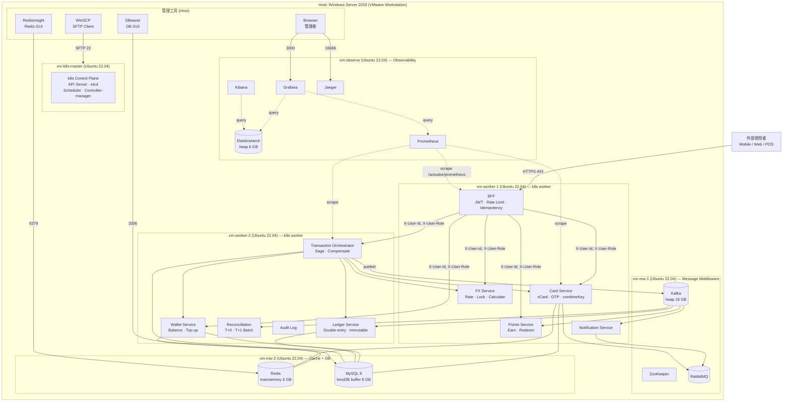

# Infrastructure Configuration

This chapter describes the infrastructure configuration of WillCard,
covering the physical host specification, VM layout, resource allocation,
and the observability stack.

WillCard's entire service landscape runs on a single Windows Server 2019
physical host using VMware Workstation as the hypervisor.

## Physical Host Specification

| Item | Specification |
| --- | --- |
| OS | Windows Server 2019 |
| CPU | AMD Ryzen 5 3600X (6 cores / 12 threads, 3.8 GHz) |
| RAM | 128 GB |
| SSD | 2 TB |
| Hypervisor | VMWare workstation |

**Allocatable resources** (after Host OS reservation):

| Resource | Allocatable |
|---|---|
| vCPU | 10 vCPU |
| RAM | ~116 GB |
| Disk | ~900 GB |

### VM Layout (6 VMs)

| VM | Role | vCPU | RAM | Disk | Services |
| --- | --- | --- | --- | --- | --- |
| `vm-k8s-master` | k8s control plane | 2 | 8 GB | 60 GB | API Server, etcd, Scheduler, Controller-manager |
| `vm-worker-1` | k8s worker (lightweight) | 2 | 16 GB | 80 GB | BFF, Card svc, Points svc, FX svc, Notification svc |
| `vm-worker-2` | k8s worker (core) | 3 | 32 GB | 80 GB | Txn Orchestrator, Wallet svc, Ledger svc, Reconciliation, Audit log |
| `vm-mw-1` | Message middleware | 2 | 24 GB | 300 GB | Kafka (heap 16 GB), ZooKeeper, RabbitMQ |
| `vm-mw-2` | Cache + DB | 1 | 16 GB | 200 GB | Redis (maxmemory 6 GB), MySQL 8 (InnoDB buffer 8 GB) |
| `vm-observe` | Observability | 1 | 12 GB | 100 GB | Elasticsearch (heap 6 GB), Kibana, Prometheus, Grafana, Jaeger |
| **Total** | | **10 vCPU** | **108 GB** | **820 GB** | |

> Host OS + Hypervisor reserves approximately 20 GB RAM; ~8 GB headroom remains.

### Typology

### VM Operating System

All VMs run **Ubuntu 22.04 LTS**. Fluentd is deployed as a DaemonSet on the two worker nodes and does not consume resources on `vm-observe`.

Next Chapter: [Project Architecture](/guideline/3-project-architecture-structure.md)
